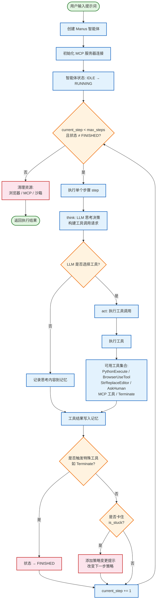

[](https://github.com/Cecil09312/OpenManus-gui/stargazers)
&ensp;
[](https://opensource.org/licenses/MIT) &ensp;
[](https://discord.gg/DYn29wFk9z)
[](https://huggingface.co/spaces/lyh-917/OpenManusDemo)
[](https://doi.org/10.5281/zenodo.15186407)

## 项目演示

## 安装

我们提供两种安装方式。推荐使用方式 2（使用 uv），安装速度更快、依赖管理更优。

### 方式一：使用 conda

1. 创建新的 conda 环境：

```bash
conda create -n open_manus python=3.12
conda activate open_manus
```

2. 克隆仓库：

```bash
git clone https://github.com/Cecil09312/OpenManus-gui.git
cd OpenManus-gui
```

3. 安装依赖：

```bash
pip install -r requirements.txt
```

### 方式二：使用 uv（推荐）

1. 安装 uv（一个快速的 Python 包安装器和解析器）：

```bash
curl -LsSf https://astral.sh/uv/install.sh | sh
```

2. 克隆仓库：

```bash
git clone https://github.com/Cecil09312/OpenManus-gui.git
cd OpenManus-gui
```

3. 创建新的虚拟环境并激活：

```bash
uv venv --python 3.12
source .venv/bin/activate  # 在 Unix/macOS 上
# 或在 Windows 上：
# .venv\Scripts\activate
```

4. 安装依赖：

```bash
uv pip install -r requirements.txt
```

### 浏览器自动化工具（可选）
```bash
playwright install
```

## 配置

OpenManus 需要为其使用的 LLM API 进行配置。请按照以下步骤完成配置：

1. 在 `config` 目录中创建 `config.toml` 文件（可以从示例文件复制）：

```bash
cp config/config.example.toml config/config.toml
```

2. 编辑 `config/config.toml`，添加你的 API Key 并自定义设置：

```toml
# 全局 LLM 配置
[llm]
model = "gpt-4o"
base_url = "https://api.openai.com/v1"
api_key = "sk-..."  # 替换为你的实际 API Key
max_tokens = 4096
temperature = 0.0

# 特定 LLM 模型的可选配置
[llm.vision]
model = "gpt-4o"
base_url = "https://api.openai.com/v1"
api_key = "sk-..."  # 替换为你的实际 API Key
```

## 快速开始

一行命令运行 OpenManus-gui：

```bash
python main.py
```

然后通过终端输入你的想法！

如需运行 MCP 工具版本，可以执行：
```bash
python run_mcp.py
```

如需运行不稳定的多智能体版本，也可以执行：

```bash
python run_flow.py
```

### 自定义添加多个智能体

目前，除了通用的 OpenManus 智能体外，我们还集成了 DataAnalysis 智能体，适用于数据分析和数据可视化任务。你可以在 `config.toml` 中将此智能体添加到 `run_flow`。

```toml
# run-flow 的可选配置
[runflow]
use_data_analysis_agent = true     # 默认禁用，改为 true 即可启用
```
此外，你还需要安装相关依赖，以确保智能体正常运行：[详细安装指南](app/tool/chart_visualization/README.md##Installation)

## 工作流程

以下流程图展示了 OpenManus 智能体的核心执行流程：



**工作流程的关键组成部分：**

- **ReAct 循环**：每个步骤遵循 `think()` → `act()` 模式，由 LLM 对当前状态进行推理并决定调用哪些工具，然后执行它们。
- **工具执行**：智能体可以并行调用多个内置工具（Python 执行、浏览器自动化、文件编辑）和远程 MCP 工具。
- **状态管理**：智能体在 `IDLE`、`RUNNING`、`FINISHED` 和 `ERROR` 状态之间转换，并具有可配置的 `max_steps` 限制（默认：30）。
- **卡住检测**：当检测到重复响应时，智能体会注入策略变更提示以跳出循环。
- **优雅关闭**：在完成或达到步骤上限时，智能体会清理浏览器会话、MCP 连接和沙箱资源。

## 如何贡献

我们欢迎任何友好的建议和有益的贡献！只需创建 issue 或提交 pull request 即可。

也可以通过 📧邮箱联系 @mannaandpoem：mannaandpoem@gmail.com

**注意**：在提交 pull request 之前，请使用 pre-commit 工具检查你的更改。运行 `pre-commit run --all-files` 执行检查。

## 社区交流群

加入我们的飞书交流群，与其他开发者分享你的经验！

<div align="center" style="display: flex; gap: 20px;">
    
</div>

## Star 历史

[](https://star-history.com/#Cecil09312/OpenManus-gui&Date)

## 赞助商
感谢 [PPIO](https://ppinfra.com/user/register?invited_by=OCPKCN&utm_source=github_openmanus&utm_medium=github_readme&utm_campaign=link) 提供算力支持。
> PPIO：性价比最高、最易集成的 MaaS 和 GPU 云解决方案。


## 致谢

感谢 [anthropic-computer-use](https://github.com/anthropics/anthropic-quickstarts/tree/main/computer-use-demo)、[browser-use](https://github.com/browser-use/browser-use) 和 [crawl4ai](https://github.com/unclecode/crawl4ai) 为本项目提供基础支持！

此外，我们还要感谢 [AAAJ](https://github.com/metauto-ai/agent-as-a-judge)、[MetaGPT](https://github.com/geekan/MetaGPT)、[OpenHands](https://github.com/All-Hands-AI/OpenHands) 和 [SWE-agent](https://github.com/SWE-agent/SWE-agent)。

我们同样感谢 stepfun（阶跃星辰）对我们 Hugging Face 演示空间的支持。

OpenManus 由来自 MetaGPT 的贡献者构建。非常感谢这个智能体社区！

## 引用
```bibtex
@misc{openmanus2025,
  author = {Xinbin Liang and Jinyu Xiang and Zhaoyang Yu and Jiayi Zhang and Sirui Hong and Sheng Fan and Xiao Tang and Bang Liu and Yuyu Luo and Chenglin Wu},
  title = {OpenManus: An open-source framework for building general AI agents},
  year = {2025},
  publisher = {Zenodo},
  doi = {10.5281/zenodo.15186407},
  url = {https://doi.org/10.5281/zenodo.15186407},
}
```
